## EIDOLON — a narrative puzzle platformer

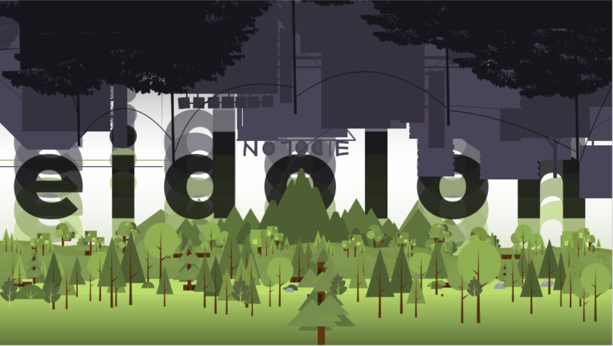

#### Team Members:
- 👨‍🎨 Project Lead, Graphics – Ed Marcel Godinez Lasco
- 🎶 Graphics & Music Designer – Lian Luigi Paredes
- 📝 Pitching, Programmer, Documentation – John Benedict Binas
- 💻 Main Programmer – Kenneth Daroy Pabillo

___

### Summary:
Step into the haunting world of **EIDOLON**, where **Bonnie** pursues a mysterious ghost through shifting environments that blur the line **between memory and reality**.  

Players must help Bonnie get closer to the ghost by solving environmental puzzles and switching perspectives between **Bonnie** and **Boo** — her counterpart.  

Each character offers **unique abilities** that must be used strategically to uncover the ghost’s origins...

Learn more about the game by checking out the 📄 [concept paper »](./EIDOLON-ConceptPaper.pdf).

___

## Hackathon Requirements and Specifics

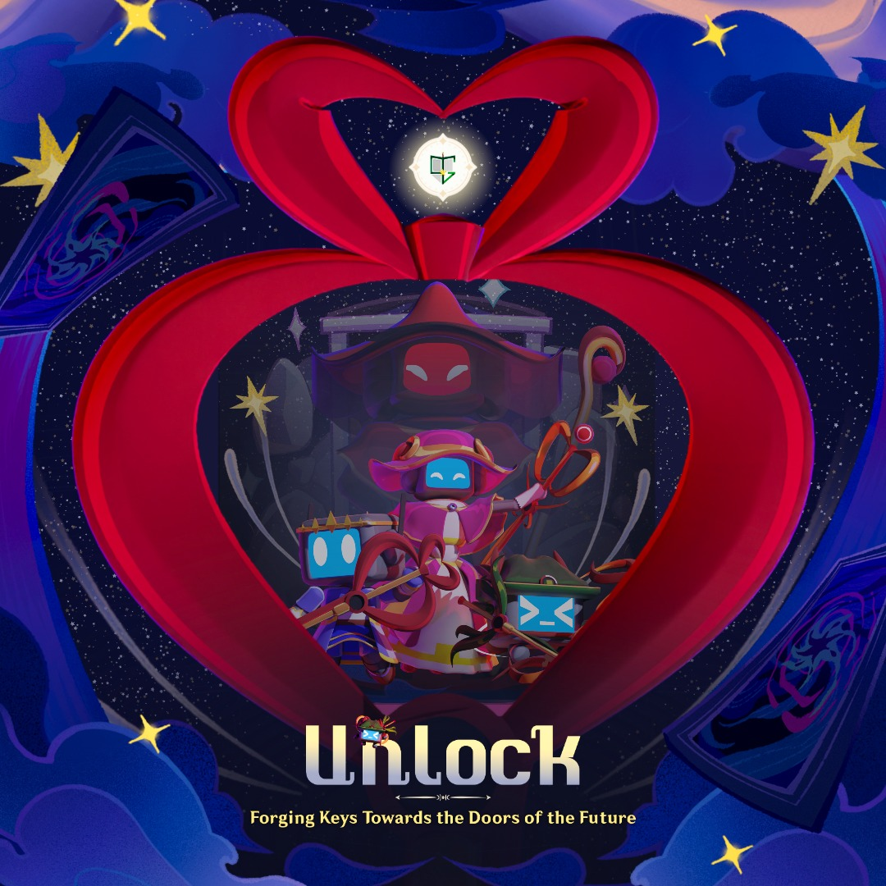
_Artwork courtesy of The Programmers Guild._

#### Contest Details:

**Unlock(): Forging Keys Towards the Doors of the Future** is the flagship week-long event of PUP The Programmers’s Guild (TPG), blending storytelling,creativity, and technology into a transformative, and reflective experience.

Hosted by **PUP The Programmers' Guild (PUP TPG)** is a non-academic organization affiliated with the Polytechnic University of the Philippines (PUP)

#### Contest Theme:

**Unlock()** revolves around the core idea that _**“Keys are not given, they are forged through trials.”**_ While the event provides guiding metaphors such as keys, doors, and realms, these are not limitations. Instead, they are launch points for creativity.

**Interpret the theme in unique and personal ways**. A _“door”_ can symbolize opportunity, failure, or even memory. A _“key”_ can represent courage, resilience, or collaboration.

___

## Game Mechanics

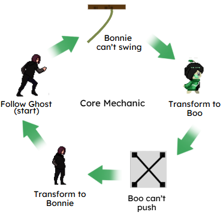

- **Chase the ghost** through surreal and changing landscapes.  
- **Solve puzzles** by interacting with objects and the environment.  
- **Switch perspectives** between *Bonnie* (physical interaction) and *Boo* (spiritual insight).  
- **Uncover the story** behind the ghost as the narrative unfolds.

___

## Game Snippet: Bonnie perspective

_Bonnie and the ghostly figure_
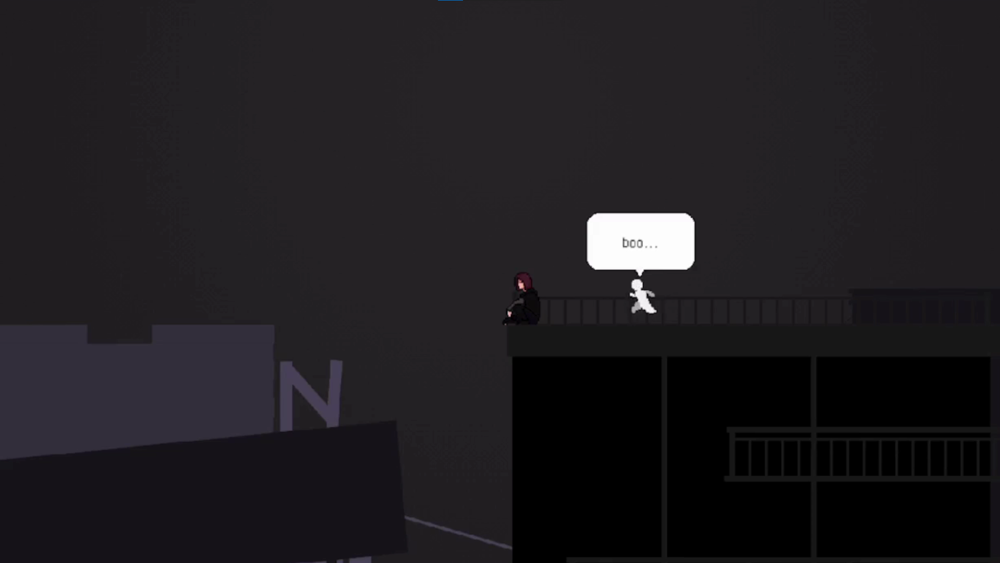

_Bonnie pulling a box_
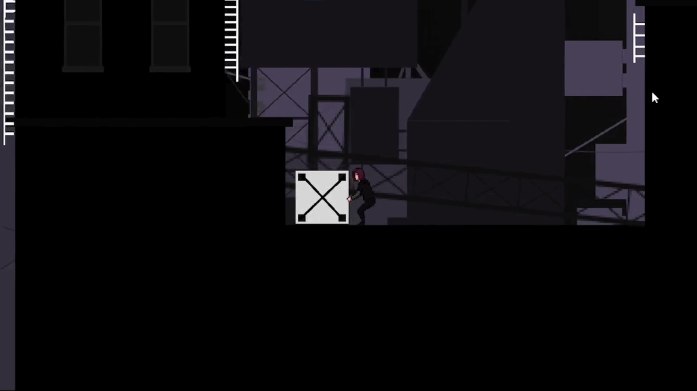

_Bonnie on a building sign_
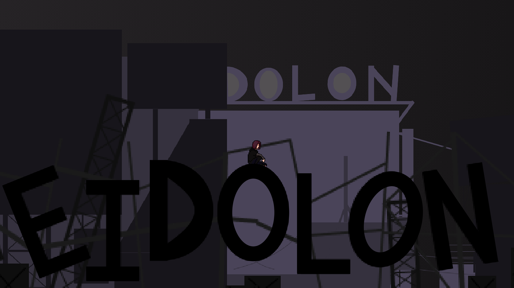

_Bonnie ziplining_
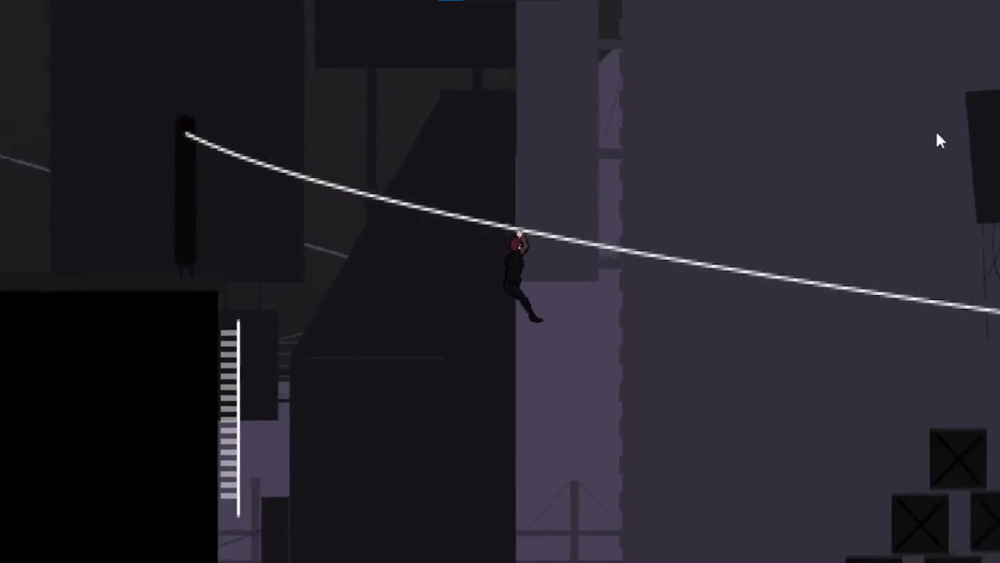

___

## Game Snippet: Alternate Boo perspective

_Boo on a tree_
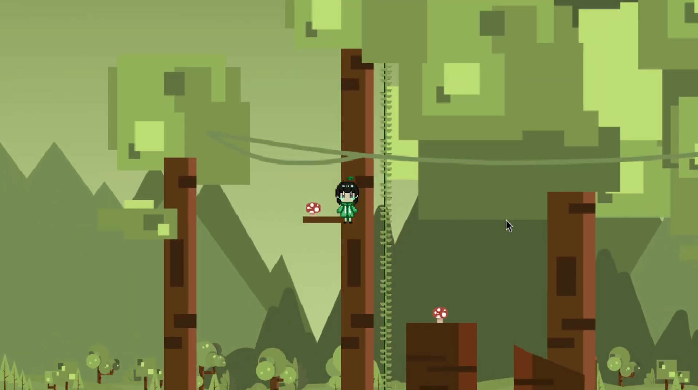

_Boo ziplining_
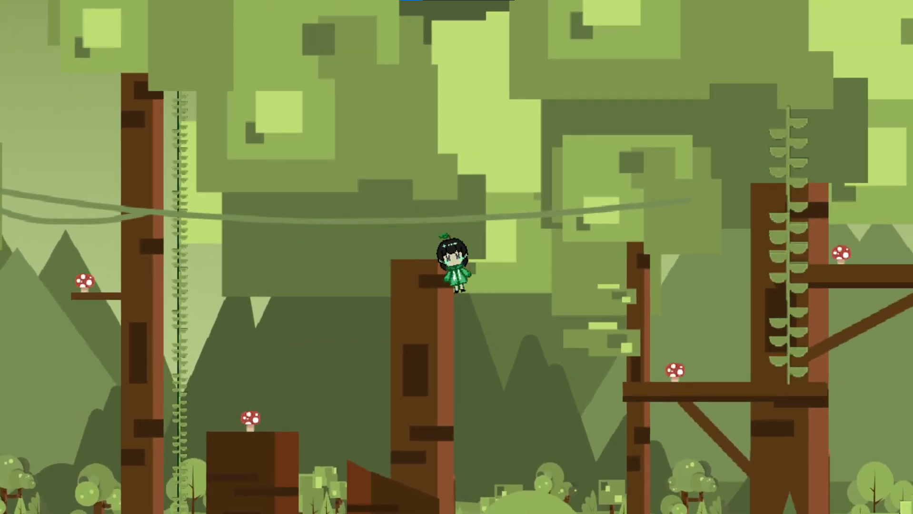

_Boo on a vine_
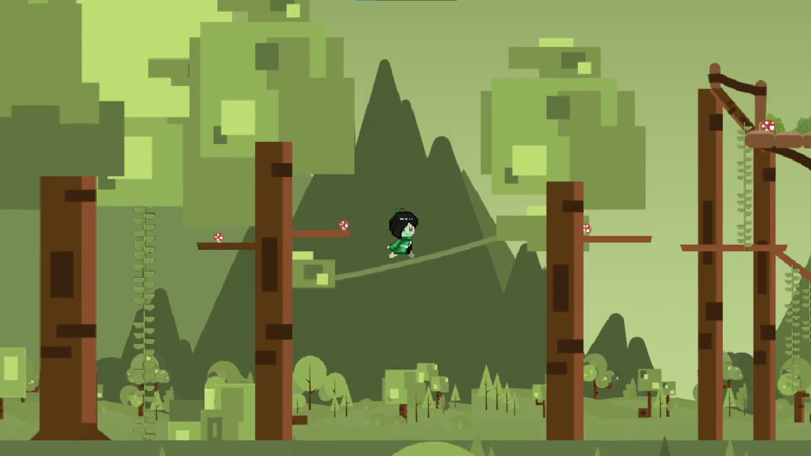

_Boo in a forest landscape_
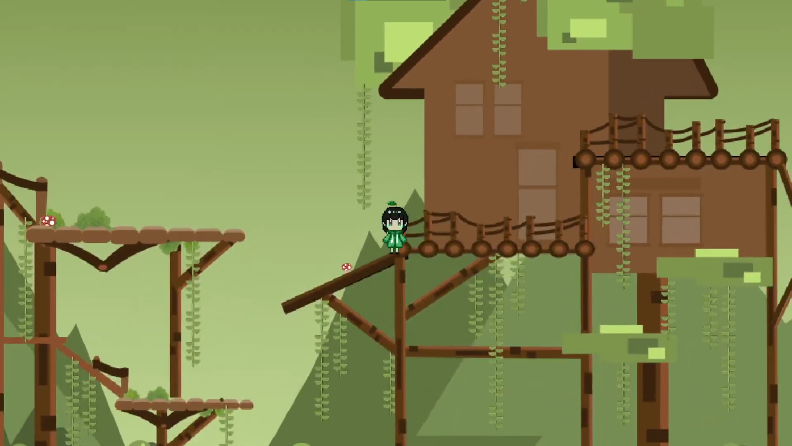

___

### Platform & Tools Used
- **Engine:** Godot Engine
- **Graphic Design & Character Assets:** Piskels, Canva, Figma
- **Audio Assets:** Bosca Ceoil

___

### Checkout our original soundtrack

Eidolon features an **original background track** titled _**“oknotok”**_, composed specifically for the game through **Bosca Ceoil** - The piece draws inspiration from **Radiohead’s “Motion Picture Soundtrack”** to reflect the game’s melancholic and atmospheric tone.

**visit: https://youtu.be/Bxh0bdeAKmU?si=_NPmTR6B-DSCKy7N**
___

### Other references

Use of **free sprite resources from** itch.io and craftpix.net for other components. Additional environmental sprites for the dystopian city and the alternate childlike forest world.

**Ambient and interaction SFX** (footsteps, switching characters, etc.) are sourced from free sound effect libraries available online. https://kronbits.itch.io/freesfx

**Checkout our concept paper** provided in this repository which goes into a deeper dive regarding all the details of the game development process.

📄 [View the full concept paper here »](./EIDOLON-ConceptPaper.pdf)
